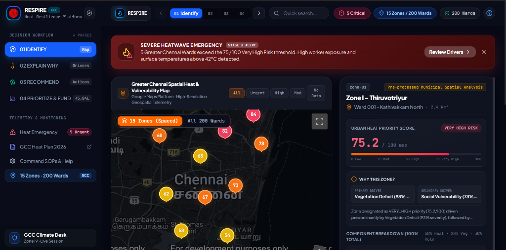

<div align="center">


# RESPIRE
### Urban Heat Intelligence & Municipal Climate Action Platform

[](https://react.dev/)
[](https://www.typescriptlang.org/)
[](https://tailwindcss.com/)
[](https://vite.dev/)
[-10B981?style=for-the-badge&logo=jest&logoColor=white)](#-test-suite--validation-matrix)
[](#-spatial-data-coverage)

<p align="center">
  <b>A transparent, deterministic decision-support platform engineered for Municipal Planning Officers, Disaster Management Cells, and Climate Engineers across Greater Chennai Corporation (GCC).</b>
</p>

[Explore Workflow](#-the-4-pillar-decision-workflow) • [System Architecture](#-system-architecture) • [Backend Pipeline Guide](./backend/README.md) • [Jury Pipeline Explainer](./backend/PIPELINE_EXPLAINER.md) • [Mathematical Model](#-mathematical-formulation) • [Quick Start](#-quick-start)

<br/>



</div>

---

## 🎯 The 4-Pillar Decision Workflow

RESPIRE converts raw satellite thermal telemetry and socioeconomic vulnerability metrics into justifiable, auditable municipal capital investments across a continuous four-stage pipeline:


| Phase | Municipal Question | Technical Delivery | Key Outputs |
| :--- | :--- | :--- | :--- |
| **01 · IDENTIFY** | *Where is acute heat vulnerability concentrated?* | Spatial fusion of Landsat 8/9 LST, Sentinel-2 NDVI, and census demographics. | 200 Ward Heat Risk Map, Ward Profile Cards, Summary Risk Distribution. |
| **02 · EXPLAIN** | *Why did this specific ward score high?* | Exact additive decomposition into Heat, Vegetation, and Social Vulnerability drivers. | Additive Point Score (0–100), Primary/Secondary Drivers, Completeness Ratio. |
| **03 · RECOMMEND** | *What specific interventions should be deployed?* | Deterministic rule matrix matching diagnosed root causes to cooling solutions. | Hydration Hubs, Cool Roof Clusters, Urban Green Canopies, Misting Corridors. |
| **04 · PRIORITIZE** | *Which interventions should GCC fund first?* | Decision-grade capital prioritization matrix balancing risk, population, and budget. | Ranked Investment Queue, ₹5.04L Capital Allocation, Expected °C Impact. |

---

## 📐 Mathematical Formulation

### 1. Multi-Criteria Urban Heat Priority Score (UHPS)
Risk scoring executes with **100% mathematical determinism** without black-box machine learning:

$$\text{UHPS} = w_{\text{heat}} \cdot S_{\text{heat}} + w_{\text{veg}} \cdot S_{\text{veg}} + w_{\text{vuln}} \cdot S_{\text{vuln}}$$

$$\text{UHPS} = (0.50 \times S_{\text{heat}}) + (0.20 \times S_{\text{veg}}) + (0.30 \times S_{\text{vuln}})$$

Where:
- **$S_{\text{heat}}$** $\in [0, 100]$: Normalized Land Surface Temperature severity ($\text{Weight} = 50\%$, $\text{Max} = 50\text{ pts}$).
- **$S_{\text{veg}}$** $\in [0, 100]$: Normalized Vegetation Deficit from Sentinel-2 NDVI ($\text{Weight} = 20\%$, $\text{Max} = 20\text{ pts}$).
- **$S_{\text{vuln}}$** $\in [0, 100]$: Social Vulnerability Index reflecting outdoor worker density & compact built environment ($\text{Weight} = 30\%$, $\text{Max} = 30\text{ pts}$).

### 2. Planning Priority Score (Capital Allocation)
Municipal funding prioritization ranks candidates via decision-grade weights:

$$\text{Priority Score} = (0.50 \times \text{Risk Score}) + (0.30 \times \text{Population Density Proxy}) + (0.20 \times \text{Cost Feasibility})$$

---

## 🏛️ System Architecture

```
┌────────────────────────────────────────────────────────────────────────┐
│                          PRESENTATION LAYER                            │
│  ┌──────────────────────────────────────────────────────────────────┐  │
│  │                     RESPIRING LANDING PAGE                       │  │
│  │    • Hero Console  • Live Ward Spotlight  • Methodology Overview  │  │
│  └─────────────────────────────────┬────────────────────────────────┘  │
│                                    │                                   │
│  ┌─────────────────────────────────▼────────────────────────────────┐  │
│  │                    MUNICIPAL COMMAND DECK                        │  │
│  │  ┌───────────────┐ ┌───────────────┐ ┌───────────┐ ┌───────────┐ │  │
│  │  │  01 IDENTIFY  │ │   02 EXPLAIN  │ │03RECOMMEND│ │04PRIORITIZE│ │  │
│  │  │  Spatial Map  │ │ Decomposition │ │ Rule Engine│ │ Capital Q │ │  │
│  │  └───────────────┘ └───────────────┘ └───────────┘ └───────────┘ │  │
│  └─────────────────────────────────┬────────────────────────────────┘  │
└────────────────────────────────────┼───────────────────────────────────┘
                                     │
┌────────────────────────────────────▼───────────────────────────────────┐
│                     DECOUPLED CORE DOMAIN ENGINES                      │
│  • RespireScoringEngine        (50/20/30 Additive Decomposition)       │
│  • RespireRecommendationEngine (Deterministic Intervention Rules)      │
│  • RespirePrioritizationEngine (Multi-Criteria Capital Allocator)      │
└────────────────────────────────────┬───────────────────────────────────┘
                                     │
┌────────────────────────────────────▼───────────────────────────────────┐
│                     DATA BOUNDARY & INGESTION                          │
│  • RespireApiClient          (Decoupled Service Boundary)              │
│  • ProcessedDataProvider     (200 GCC Wards Normalized Telemetry)      │
│  • CalibratedDemoProvider    (10 Verified GCC Baseline Wards)          │
└────────────────────────────────────────────────────────────────────────┘
```

---

## 🔒 Data Provenance & Safety Rules

Every data point and recommendation within RESPIRE carries an explicit provenance status:

| Provenance Status | Definition | Example Application |
| :--- | :--- | :--- |
| `SOURCED` | Directly ingested from authoritative sources (USGS Landsat 8/9 TIRS, Copernicus Sentinel-2, GCC Census). | Measured LST (42.1°C), Ward Boundaries. |
| `DERIVED` | Statistically calculated via documented deterministic mathematical formulas. | Multi-Criteria Risk Score (88.0/100). |
| `INDICATIVE_ESTIMATE` | Planning-grade operational and financial benchmarks. | Benchmark Cost (₹72,000), Temp Reduction (-4.5°C). |
| `ASSUMPTION` | Documented municipal proxies when empirical field surveys are pending. | Built environment density proxies. |
| `INSUFFICIENT_EVIDENCE` | **Missing data safety**: Unscored wards are isolated with null metrics; never assigned fabricated defaults. | Ward 198 (OMR Corridor). |

---

## 🗺️ Spatial Data Coverage

RESPIRE provides comprehensive coverage across all **15 Greater Chennai Corporation Administrative Zones**:

```
Zone I    · Thiruvottiyur     | Zone VI   · Thiru-Vi-Ka Nagar | Zone XI   · Valasaravakkam
Zone II   · Manali            | Zone VII  · Ambattur          | Zone XII  · Alandur
Zone III  · Madhavaram        | Zone VIII · Anna Nagar        | Zone XIII · Adyar
Zone IV   · Tondiarpet        | Zone IX   · Teynampet         | Zone XIV  · Perungudi
Zone V    · Royapuram         | Zone X    · Kodambakkam       | Zone XV   · Sholinganallur
```

---

## 🧪 Test Suite & Validation Matrix

RESPIRE includes a comprehensive automated test suite guaranteeing scoring accuracy, deterministic recommendation integrity, and judge-proof error handling:

```bash
npm run test
```

```
================================================================
TEST SUITE SUMMARY
================================================================
  ✅ IDENTIFY DASHBOARD TESTS    : 12 PASSED | 0 FAILED
  ✅ EXPLAIN WHY DASHBOARD TESTS : 14 PASSED | 0 FAILED
  ✅ RECOMMEND ACTIONS TESTS     : 14 PASSED | 0 FAILED
  ✅ PRIORITIZE & FUND TESTS     : 14 PASSED | 0 FAILED
  ✅ STEP 10 E2E HARDENING TESTS : 12 PASSED | 0 FAILED
================================================================
TOTAL: 66 PASSED | 0 FAILED (100% Pass Rate)
================================================================
```

---

## 🚀 Quick Start

### Prerequisites
- **Node.js**: `v20.x` or `v22.x+`
- **npm**: `v10.x+`

### 1. Clone & Install
```bash
git clone https://github.com/ramanan-sethuraman/Respire.git
cd Respire
npm install
```

### 2. Configure Environment (Optional)
```bash
cp .env.example .env
# Add your Google Maps Platform API Key if using Google Maps Mode:
# VITE_GOOGLE_MAPS_API_KEY=your_api_key_here
```

### 3. Run Development Server
```bash
npm run dev
# or
npm start
```
The application will launch at `http://localhost:5173`.

### 4. Available Scripts
| Command | Description |
| :--- | :--- |
| `npm run dev` / `npm start` | Launches Vite local development server with HMR. |
| `npm run build` | Compiles TypeScript and builds optimized production bundle. |
| `npm run test` | Executes the full 66-test verification suite. |
| `npm run lint` | Runs ultra-fast oxlint across all source files. |
| `npm run audit:scoring` | Runs CLI audit demo for multi-criteria scoring calculations. |
| `npm run audit:recommendations`| Runs CLI audit demo for intervention rule evaluations. |

---

## 📜 License

This project is licensed under the MIT License — see the [LICENSE](LICENSE) file for details.

<div align="center">
  <sub>Built with scientific rigor for Greater Chennai Corporation (GCC) Urban Climate Resilience.</sub>
</div>
