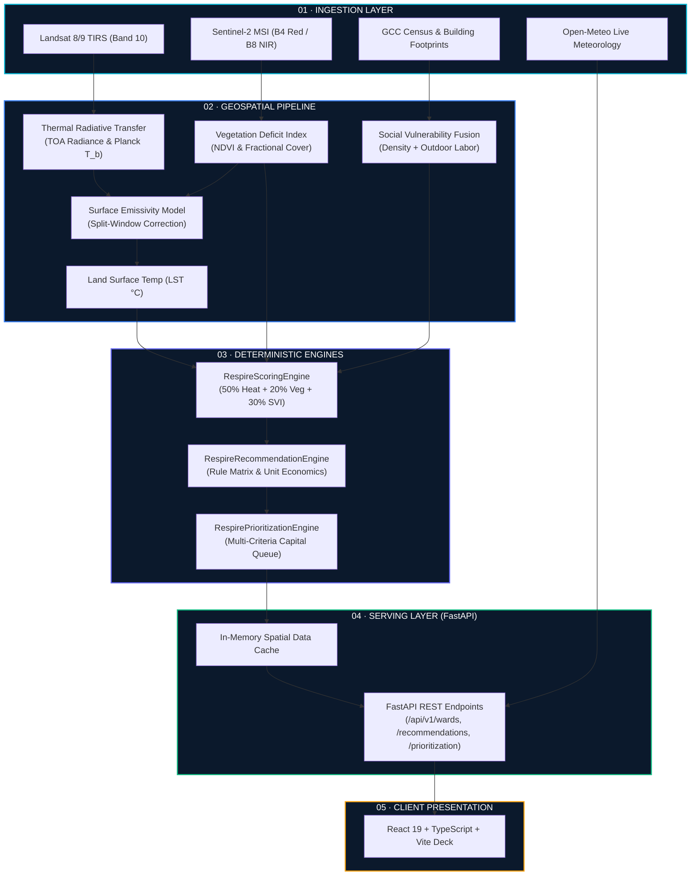

# 🛰️ RESPIRE Backend Pipeline & Architecture

> **Urban Heat Reduction & Municipal Climate Resilience Decision Engine**  
> *Greater Chennai Corporation (GCC) • 200 Administrative Wards • 15 Zones*

---

## 📋 Table of Contents
1. [Overview & Philosophy](#-overview--philosophy)
2. [End-to-End System Architecture](#-end-to-end-system-architecture)
3. [The 5-Stage Data Processing Pipeline](#-the-5-stage-data-processing-pipeline)
4. [Mathematical Formulation](#-mathematical-formulation)
5. [Directory Structure](#-directory-structure)
6. [Quick Start & Setup](#-quick-start--setup)
7. [API Endpoint Reference](#-api-endpoint-reference)
8. [Civic Trust & Data Provenance Rules](#-civic-trust--data-provenance-rules)

---

## 💡 Overview & Philosophy

The **RESPIRE Backend** is engineered for **municipal transparency, mathematical determinism, and instant auditability**. Unlike opaque deep learning models, RESPIRE uses validated physics-based radiative transfer formulas, satellite band ratios, and standard multi-criteria decision models (MCDM).

- **100% Deterministic:** Every score can be hand-verified on paper using the 50/20/30 formula.
- **Civic Trust Built-In:** Incomplete or cloud-obscured data (e.g. Ward 198) is explicitly flagged with `INSUFFICIENT_EVIDENCE` rather than fabricated with default numbers.
- **Action-Oriented:** Directly pairs thermal anomalies with quantifiable civic budgets, physical cooling structures, and expected temperature reductions.

---

## 🏛️ End-to-End System Architecture



---

## ⚙️ The 5-Stage Data Processing Pipeline

```
[Stage 1: Satellite Radiance Ingestion]
       │  • Convert USGS Landsat Band 10 Digital Numbers to TOA Radiance
       │  • Calculate Sentinel-2 Normalized Difference Vegetation Index (NDVI)
       ▼
[Stage 2: Radiative Transfer & LST Calibration]
       │  • Apply Planck Equation for At-Sensor Brightness Temperature (K)
       │  • Estimate Surface Emissivity via Fractional Vegetation Cover (FVC)
       │  • Derive Calibrated Land Surface Temperature (LST in °C)
       ▼
[Stage 3: Socioeconomic & Zonal Vector Fusion]
       │  • Overlay 200 GCC Ward Vector Geometries (15 Administrative Zones)
       │  • Merge Census Density, Informal Settlements & Outdoor Labor Indices
       │  • Execute Cloud Obscuration Safety Check (>20% Cloud = Flagged)
       ▼
[Stage 4: 50/20/30 Additive Multi-Criteria Scoring]
       │  • Heat Severity Points (Max 50 pts)
       │  • Canopy Deficit Points (Max 20 pts)
       │  • Social Vulnerability Points (Max 30 pts)
       │  • Classify Risk Tier (VERY HIGH, HIGH, MODERATE, LOW, UNSCORED)
       ▼
[Stage 5: Rule-Based Cooling & Capital Allocation]
       │  • Match Diagnosed Thermal Drivers to Interventions (Cool Roofs, Miyawaki, Shelters)
       │  • Rank Capital Queue: (0.50 Risk + 0.30 Density + 0.20 Cost Feasibility)
       │  • Simulate Municipal Budget Constraints (e.g. ₹50 Lakhs)
```

---

## 📐 Mathematical Formulation

### 1. Land Surface Temperature (LST) Calculation
Top-Of-Atmosphere (TOA) spectral radiance $L_\lambda$ and brightness temperature $T_b$:

$$L_\lambda = (M_L \cdot \text{DN}) + A_L$$

$$T_b = \frac{K_2}{\ln\left(\frac{K_1}{L_\lambda} + 1\right)}$$

Land Surface Temperature ($LST$ in °C) with emissivity correction $\varepsilon$:

$$\text{LST} = \frac{T_b}{1 + \left(\frac{\lambda \cdot T_b}{\rho}\right) \cdot \ln(\varepsilon)} - 273.15$$

Where $\lambda = 10.895\,\mu\text{m}$, $\rho = 14,388\,\mu\text{m}\cdot\text{K}$, $K_1 = 774.8853\,\text{W}/(\text{m}^2\cdot\text{sr}\cdot\mu\text{m})$, $K_2 = 1321.0789\,\text{K}$.

---

### 2. Multi-Criteria Urban Heat Priority Score (UHPS)
Risk scoring executes with **100% mathematical determinism**:

$$\text{UHPS} = (0.50 \times S_{\text{heat}}) + (0.20 \times S_{\text{veg}}) + (0.30 \times S_{\text{vuln}})$$

- **$S_{\text{heat}}$**: Normalized LST against Chennai baseline ($30^\circ\text{C} - 45^\circ\text{C}$).
- **$S_{\text{veg}}$**: Normalized Canopy Deficit ($0.65 - 0.05$ NDVI).
- **$S_{\text{vuln}}$**: Social Vulnerability Index (Density, outdoor workers, informal housing).

---

### 3. Capital Priority Score (Queue Optimization)

$$\text{Priority Score} = (0.50 \times \text{Risk Score}) + (0.30 \times \text{Density Proxy}) + (0.20 \times \text{Cost Feasibility})$$

---

## 📂 Directory Structure

```
backend/
├── api/
│   ├── main.py                 # FastAPI Application & REST Routing
│   └── schemas.py              # Pydantic Request/Response Models
├── engine/
│   ├── scoring.py              # Deterministic 50/20/30 Scoring Engine
│   ├── recommendations.py      # Site-Specific Cooling Rule Matrix
│   └── prioritization.py       # Multi-Criteria Capital Budget Allocator
├── pipeline/
│   ├── thermal_processor.py    # Satellite Radiative Transfer & LST Conversion
│   ├── demographic_fusion.py   # Census Vulnerability & Density Fusion
│   └── spatial_aggregator.py   # 15 Zones / 200 Wards Hierarchy & Quality Guard
├── run_pipeline.py             # CLI Pipeline Runner for 200 Wards
├── requirements.txt            # Python Dependencies
├── README.md                   # Technical Developer Guide (This File)
└── PIPELINE_EXPLAINER.md       # Simplified Jury & Evaluation Guide
```

---

## 🚀 Quick Start & Setup

### 1. Prerequisites
- Python 3.10+ installed

### 2. Install Dependencies
```bash
pip install -r backend/requirements.txt
```

### 3. Run the CLI Pipeline Runner
To execute the complete 5-stage ETL, scoring, and budget allocation across all 200 wards:
```bash
python backend/run_pipeline.py
```

### 4. Start the FastAPI Server
```bash
uvicorn backend.api.main:app --reload --port 8000
```
Interactive API docs will be available at: **`http://localhost:8000/docs`**

---

## 📡 API Endpoint Reference

| Method | Endpoint | Description |
| :--- | :--- | :--- |
| `GET` | `/health` | System health check and total loaded wards count. |
| `GET` | `/api/v1/metadata` | Provenance metadata, formula details, and calibration dates. |
| `GET` | `/api/v1/wards` | List 200 GCC Wards with optional `?zone=`, `?tier=`, `?search=` filters. |
| `GET` | `/api/v1/wards/{ward_id}` | Detailed diagnostic breakdown for a specific ward (e.g. `ward-045`). |
| `GET` | `/api/v1/recommendations/{ward_id}` | Site-specific cooling packages, unit economics, and expected °C impact. |
| `GET` | `/api/v1/prioritization` | Ranked municipal capital queue with dynamic `?budget_lakhs=` simulator. |
| `POST` | `/api/v1/pipeline/run` | Triggers an on-demand satellite ingestion and calibration run. |
| `GET` | `/api/v1/weather/live` | Current Chennai meteorological telemetry and calculated heat index. |

---

## 🛡️ Civic Trust & Data Provenance Rules

| Provenance Tag | Meaning | System Behavior |
| :--- | :--- | :--- |
| `SOURCED` | Authoritative measurement from USGS / Sentinel / GCC Census. | Used directly in physical calculations. |
| `DERIVED` | Calculated via transparent mathematical formula. | Fully decomposable in the UI breakdown. |
| `INDICATIVE_ESTIMATE` | Standard GCC municipal engineering unit benchmark. | Displayed with clear cost assumptions. |
| `INSUFFICIENT_EVIDENCE` | Data obscured by cloud cover or sensor malfunction. | **Safety Isolation**: Ward is flagged as `UNSCORED` to prevent capital misallocation. |
